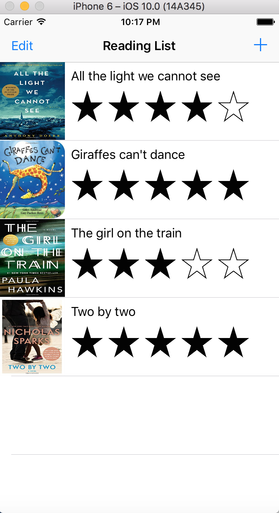

## EC601_HW2
## My Reading List Application for iOS 

## Description

My Reading List application is designed to provider book-lovers a place to record every book they have read.

In this application, users could add the book they have read already or the book they wish to read in the 

future using simple operations. This app is good for those people who would like to have a general view of all 

the books they like and is easy for them to review each book. They could also rate the book depending on how 

much they like it. This app is written in Swift and should work perfect with iPhone 6.

## User Manual

Simply:

 There are four books that have been preloaded to the program and been rated already.

 The users could tap the "+" button on the top right to add a new book they are interested in and also 

add a photo cover of the book from photo library in their phone.

 The users could also click on a certain book on the first page to see detailed description.

 The users could also delete the book on the bookshelf by tapping the "Edit" button on the top left.

 The code in this application is modified from the FoodTracker application from 

    https://developer.apple.com/library/content/referencelibrary/GettingStarted/DevelopiOSAppsSwift/index.html#//apple_ref/doc/uid/TP40015214-CH2-SW1

